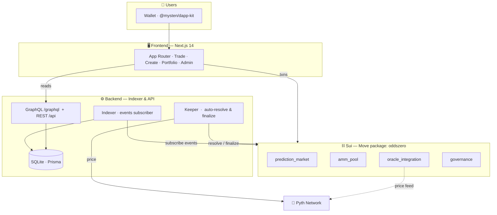
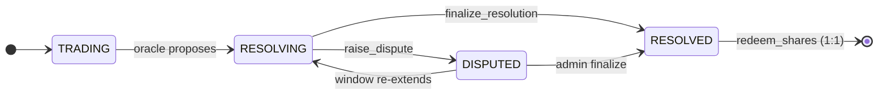

<!-- ============================================================= -->
<!--                          O D D S Z E R O                      -->
<!-- ============================================================= -->

<div align="center">

<a href="https://sui.io/">
  
</a>

<br/>
<br/>

<h1>OddsZero</h1>

<p><strong>Fully on-chain, multi-outcome prediction markets on Sui.</strong></p>

<p>
  Trade outcome shares, provide liquidity, and redeem <code>1:1</code> against collateral —<br/>
  settled entirely in Move. Non-custodial. Fully collateralized. Permissionless.
</p>

<br/>

<!-- ── Badges ─────────────────────────────────────────────── -->

<p>
  
  
  
  
  
</p>

<p>
  
  
  
  
</p>

<br/>

<h1>OddsZero</h1>

<p><strong>Fully on-chain, multi-outcome prediction markets on Sui.</strong></p>

<p>
  Trade outcome shares, provide liquidity, and redeem <code>1:1</code> against collateral —<br/>
  settled entirely in Move. Non-custodial. Fully collateralized. Permissionless.
</p>

<br/>

<!-- ── Badges ─────────────────────────────────────────────── -->

<p>
  
  
  
  
  
</p>

<p>
  
  
  
  
</p>

<br/>

<!-- ── Nav ────────────────────────────────────────────────── -->

<p>
  <a href="#-quick-start"><b>Quick Start</b></a> &nbsp;·&nbsp;
  <a href="#-architecture"><b>Architecture</b></a> &nbsp;·&nbsp;
  <a href="#-the-protocol"><b>Protocol</b></a> &nbsp;·&nbsp;
  <a href="#-development"><b>Development</b></a> &nbsp;·&nbsp;
  <a href="#-repository-layout"><b>Layout</b></a> &nbsp;·&nbsp;
  <a href="#-security"><b>Security</b></a> &nbsp;·&nbsp;
  <a href="#-documentation"><b>Docs</b></a>
</p>

</div>

<br/>

<!-- ============================================================= -->

## ✦ What is OddsZero?

> **OddsZero is a fully on-chain prediction-market protocol on the [Sui](https://sui.io/) blockchain.**
> Anyone can trade on the outcome of future events — elections, sports, crypto prices,
> science, economics, and more — using shares whose prices reflect the market's
> collective probability estimate.

Unlike most prediction markets, which are custodial or partially off-chain, OddsZero
keeps **every market, every trade, and every resolution** in auditable Move smart
contracts. There is no backend that can freeze your funds.

<table>
<tr>
<td width="50%" valign="top">

#### 🔗 Fully on-chain
Markets, AMM, resolution, and disputes live in a **single Move package** on Sui.

#### 🔒 Non-custodial
Shares and collateral live in contracts you interact with directly. Only winning
shares are ever redeemable — **1:1** against the vault.

#### 🛡️ Fully collateralized
Vault collateral always equals one complete set of shares, so redemption can
**never** be underfunded.

</td>
<td width="50%" valign="top">

#### 🎯 Multi-outcome
Two or more outcomes per market — binary *Yes/No* or many candidates (**2–64**).

#### 🌐 Open & permissionless
Anyone can create a market, trade, provide liquidity, or raise a dispute.

#### ⚡ Automated price markets
Short-expiry binary markets *("Will BTC be UP in 15m?")* resolve automatically
against a real **Pyth** reading — no human oracle required.

</td>
</tr>
</table>

<details>
<summary><b>📖 The one-paragraph version</b></summary>

<br/>

A market holds a pool of USDC (or any Sui coin) collateral. When you buy shares of an
outcome, collateral enters the vault and a **complete set** of shares is minted (one of
every outcome); the constant-product AMM prices the shares so the pool always implies a
probability for each outcome. When the event ends, a registered oracle proposes the
winning outcome and a dispute window opens. If no successful dispute occurs, the outcome
is finalized and every holder of winning shares can redeem them **1:1** for the
collateral. A small fee is taken on each trade and routed to the protocol treasury and
the market creator.

</details>

<br/>

<!-- ============================================================= -->

## 🏗 Architecture

A monorepo built in three cooperating layers — the **chain** is the single source of
truth; the indexer and dApp are read-optimized views on top of it.



<br/>

<!-- ============================================================= -->

## 🧱 Technology Stack

<table>
<thead>
<tr><th align="left">Layer</th><th align="left">Technology</th></tr>
</thead>
<tbody>
<tr><td>🔷 <b>Smart contracts</b></td><td><a href="https://move-book.com/">Move</a> (edition 2024) on Sui</td></tr>
<tr><td>🔮 <b>Oracle</b> (price markets)</td><td><a href="https://pyth.network/">Pyth Network</a> via Wormhole</td></tr>
<tr><td>⚙️ <b>Indexer API</b></td><td>Node.js · Express · GraphQL (<code>graphql-http</code>) · Prisma</td></tr>
<tr><td>🗄️ <b>Indexer store</b></td><td>SQLite (zero-config) via Prisma</td></tr>
<tr><td>🖥️ <b>Frontend</b></td><td>Next.js 14 (App Router) · React 18 · Tailwind CSS</td></tr>
<tr><td>🔌 <b>Sui integration</b></td><td><code>@mysten/sui</code> · <code>@mysten/dapp-kit</code> · <code>@tanstack/react-query</code></td></tr>
<tr><td>📚 <b>Docs</b></td><td>VitePress</td></tr>
<tr><td>🧰 <b>Toolchain</b></td><td>Sui CLI ≥ 1.30 · Node.js ≥ 20</td></tr>
</tbody>
</table>

<br/>

<!-- ============================================================= -->

## 🚀 Quick Start

### Prerequisites

| Requirement | Notes |
| --- | --- |
| **Sui CLI** ≥ 1.30 | Install from the [official guide](https://docs.sui.io/guides/developer/getting-started/sui-install) |
| **Node.js** ≥ 20 + npm | JavaScript toolchain |
| **Sui environment** | `sui client envs` · `sui client switch --env testnet` |
| **Funded address** | For publishing — `sui client active-address` |

<br/>

### 1 · Run the full dApp locally

The fastest way to bring up everything (backend indexer + Next.js frontend):

```bash
cd sui-predict
npm install            # install root + workspace deps (or per-folder)
npm run dev            # dev-all.mjs → backend :4000 + frontend :3000
```

> 🌐 Then open **<http://localhost:3000>**

<br/>

### 2 · Build & test the smart contracts

```bash
cd sui-predict/contracts
sui move build         # compile
sui move test          # run Move unit + e2e tests
sui move lint          # Move 2024 linter
```

<br/>

### 3 · Publish to Sui (testnet)

```bash
cd sui-predict/contracts
sui client publish --gas-budget 100000000
```

Record the new **package ID** and the shared object IDs
(`MarketRegistry`, `AdminRegistry`, `Governance`, `Treasury`, `IncentiveVault`).
Then initialize protocol objects and seed sample markets — see the
[Deployment Guide](./OddsZero_Docs/guides/deployment.md) and `contracts/README.md`
for the exact calls.

<br/>

<!-- ============================================================= -->

## 🧠 The Protocol

### The complete-set invariant

While a market is trading, every unit of collateral that enters the vault mints
**one share of every outcome** (a *"complete set"*). This keeps a core invariant true
at all times:

```
Σ_outcome minted[outcome]  ==  num_outcomes × collateral_in_vault
```

When the market resolves, exactly one outcome wins. Each complete set contributes
exactly one winning share, so:

```
winning_shares_in_circulation  ==  collateral_in_vault
```

Therefore **redemption is always fully collateralized 1:1**. Fees are taken *out* of the
trader's payment and **never** enter the vault, so share backing can never be diluted.

<br/>

### Market lifecycle



| Status | Code | Meaning |
| --- | :---: | --- |
| `STATUS_OPEN` | `0` | *(reserved)* |
| `STATUS_TRADING` | `1` | Open for trading, liquidity, and auto-resolution. |
| `STATUS_RESOLVING` | `2` | Oracle proposed an outcome; dispute window open. |
| `STATUS_RESOLVED` | `3` | Final outcome locked; shares redeemable. |
| `STATUS_DISPUTED` | `4` | At least one dispute raised; window re-extended. |

> A **closing-only window** opens at `closing_only_at = ends_at − closing_only_window_ms`.
> After that, opening new positions is disallowed; only position-reducing close-out
> trades are permitted, at a discounted protocol fee.

<br/>

### Two market types

<table>
<tr>
<td width="50%" valign="top">

**1 · Normal / oracle-resolved**

2–64 free-form outcomes, resolved by a registered oracle after
`ends_at + min_resolution_delay_ms`.

</td>
<td width="50%" valign="top">

**2 · Price-backed (Up/Down/Push)**

Outcomes `["Up","Down","Push"]` with a `PriceFeedConfig`. Auto-resolves against a real
asset price at `ends_at`. A tie within tolerance resolves as **Push** and refunds *both*
Up and Down shares 1:1 (market void).

</td>
</tr>
</table>

<br/>

### Two trading venues

- **AMM (primary)** — all `buy_shares` / `sell_shares` flow through `amm_pool`, integrated
  with resolution & redemption. This is what the frontend uses.
- **CLOB order book (optional, parallel)** — `order_book.move` is an independent
  price-time limit-order book whose positions are *not* reconciled with the AMM and do
  not affect the 1:1 backing invariant.

<br/>

### Fees

All fees are in basis points (`10000 bps = 100%`). Fees are **never** added to the
collateral vault, so backing is never diluted.

| Fee | Default | Bound | Paid to |
| --- | :---: | :---: | --- |
| `protocol_fee_bps` | 100 (1.00%) | ≤ 1000 | Treasury |
| `creator_fee_bps` | set by creator | ≤ 300 | Market creator |
| `referral_fee_bps` | 50 (0.50%) | ≤ 500 | Referrer |
| `dispute_bond_bps` | 100 (1.00%) | ≤ 1000 | Bond (returned/forfeited) |
| `maker_rebate_bps` | 5000 (50%) | ≤ 10000 | Close-out discount |

> See the [Fees reference](./OddsZero_Docs/protocol/fees.md) for the exact buy/sell split formulas.

<br/>

### Resolution, disputes & redemption

1. **Propose** — a registered oracle calls `resolve_market` (or `resolve_market_price` for
   price markets), opening the dispute window.
2. **Dispute** — anyone except the oracle/creator may `raise_dispute` by posting a bond.
   The window re-extends on each dispute.
3. **Finalize** — after the window, `finalize_resolution` locks the outcome. If disputes
   exist, only the admin may finalize (escalation).
4. **Redeem** — holders call `redeem_shares` to convert winning shares to collateral 1:1.

<br/>

### Governance

A single shared `Governance` object holds global parameters. Markets **snapshot** relevant
values at creation, so global changes affect only new markets. DAO voting uses transferable
`GovernanceShare` objects; a proposal needs quorum + majority before `execute_proposal`
applies it.

<br/>

<!-- ============================================================= -->

## 📦 Contract Modules

All modules live under the `oddszero::` namespace.

| Module | Responsibility |
| --- | --- |
| `prediction_market` | `Market<T>` object, `MarketRegistry`, trading & resolution orchestration. |
| `amm_pool` | Constant-product N-outcome AMM pricing, reserves, LP math. |
| `share_token` | CTF complete-set share ledger & mint/burn accounting. |
| `coin_wrapper` | Typed `Collateral<T>` vault & coin helpers (USDC integration point). |
| `oracle_integration` | Oracle propose / dispute / finalize lifecycle & bonds. |
| `price_oracle` | Automated real-price resolution (Up/Down/Push). |
| `order_book` | Optional CLOB limit-order book venue. |
| `treasury` | Protocol fee collection & distribution. |
| `governance` | Global parameters & DAO voting. |
| `admin` | Capability-based access control (`AdminCap`, `AdminRegistry`). |
| `lp_incentives` | LP reward emission stream & `IncentiveVault`. |
| `events` | Canonical event structs & `emit_*` wrappers. |
| `errors` | Centralized, stable error-code catalog (codes 1–29). |
| `utils` | Overflow-safe math & string helpers. |

> See `sui-predict/contracts/README.md` for the full per-function guide and calling examples.

<br/>

<!-- ============================================================= -->

## 🗂 Repository Layout

<details>
<summary><b>Expand the full monorepo tree</b></summary>

```
OddsZero/
├── sui-predict/               # Application (contracts + indexer + frontend)
│   ├── contracts/             # Move smart contracts (package: oddszero)
│   │   ├── sources/           # 14 Move modules — the source of truth
│   │   ├── tests/             # Move unit & e2e tests
│   │   ├── examples/          # Sample market seeds (test_markets.json)
│   │   ├── Move.toml          # Package manifest (edition 2024)
│   │   └── README.md          # Per-package contract documentation
│   ├── backend/               # Off-chain indexer, pricing engine & API
│   │   ├── src/               # Express + GraphQL server, Pyth, keeper
│   │   ├── prisma/            # SQLite schema mirroring on-chain events
│   │   └── package.json
│   ├── frontend/              # Next.js 14 dApp (app router, Tailwind)
│   │   ├── app/               # Routes: markets, create, portfolio, admin…
│   │   ├── lib/               # Sui client, chain calls, AMM math, formatting
│   │   ├── hooks/             # Wallet & chain polling hooks
│   │   └── package.json
│   ├── scripts/               # Dev seed/deploy helpers (dev.mjs, seed-contracts.mjs)
│   ├── dev-all.mjs            # Single-command dev orchestrator (backend + frontend)
│   └── package.json
├── OddsZero_Docs/             # VitePress documentation site
│   ├── .vitepress/            # VitePress config & theme
│   ├── concepts/              # Core concepts & architecture
│   ├── protocol/              # Lifecycle, AMM math, fees, resolution, disputes…
│   ├── guides/                # User, developer, and deployment guides
│   ├── security/              # Security model & audit guide
│   ├── reference/             # Events, error codes, glossary
│   ├── introduction.md        # Docs landing content
│   └── index.md               # Docs home / hero
├── LICENSE                    # MIT
└── .gitignore
```

</details>

<br/>

<!-- ============================================================= -->

## ⚙ Backend — Indexer & API

The backend is an off-chain service that **mirrors** on-chain events into a SQLite store
and exposes read-optimized views. It is **not** a source of truth — the contracts are.

- 🔎 **GraphQL** (`/graphql`) & **REST** (`/api`) — markets, trades, positions, categories, global stats.
- 📡 **Indexer** — subscribes to `MoveEventModule: { module: "events" }` and keeps AMM reserves, volumes, liquidity, and positions in sync.
- 📈 **Pricing engine** (`amm.ts`) — derives probabilities, prices, and history from reserves.
- 🔮 **Pyth integration** (`pyth.ts`) — price-market resolution.
- 🤖 **Keeper** (`keeper.ts`) — resolves ended price markets against Pyth and finalizes markets whose dispute window has elapsed.

```bash
cd sui-predict/backend
npm run dev              # tsx watch server
npm run keeper           # automated resolution worker
npm run db:push          # sync Prisma schema to SQLite
npm run db:generate      # generate Prisma client
npm run typecheck
npm run lint
```

> ⚙️ Configure `DATABASE_URL` and contract object IDs (`PACKAGE_ID`, `REGISTRY_ID`,
> `GOVERNANCE_ID`, `TREASURY_ID`, `USDC_TYPE`, `KEEPER_*`) via the backend `.env`.

<br/>

<!-- ============================================================= -->

## 🖥 Frontend — dApp

A Next.js 14 application to browse markets, trade shares, create markets, manage
portfolios, view leaderboards, and (for admins) govern the protocol.

| Route | Purpose |
| --- | --- |
| `/` | Market list & global stats |
| `/markets/[id]` | Market detail · trade panel · order book · history |
| `/create` | Create a new market |
| `/portfolio` | A wallet's positions & redemptions |
| `/leaderboard`, `/traders` | Analytics |
| `/admin` | Admin console (gated by `ADMIN_HOST`) |

```bash
cd sui-predict/frontend
npm run dev              # next dev on :3000
npm run build && npm run start
npm run typecheck
npm run lint
```

> ⚙️ Copy `frontend/.env.example` → `frontend/.env.local` and fill in the API URL and
> deployed contract IDs (`NEXT_PUBLIC_PACKAGE_ID`, `NEXT_PUBLIC_REGISTRY_ID`,
> `NEXT_PUBLIC_TREASURY_ID`, etc.).

<br/>

<!-- ============================================================= -->

## 🛠 Development

### Useful scripts (root)

```bash
cd sui-predict
npm run dev              # backend + frontend together (dev-all.mjs)
npm run dev:frontend
npm run dev:backend
npm run build            # build frontend
npm run typecheck        # frontend typecheck
npm run seed:contracts   # seed sample markets (frontend/seedMarkets.mjs)
```

### Local env files

- `sui-predict/backend/.env` — DB URL, contract IDs, keeper credentials.
- `sui-predict/frontend/.env.local` — API URL, Sui GraphQL URL, contract IDs.

> 🔐 Both have `.example` / documented counterparts. **Never commit secrets** (see `.gitignore`).

<br/>

<!-- ============================================================= -->

## 🔐 Security

OddsZero is designed around a small set of auditable invariants:

- ✅ The **complete-set** invariant guarantees 1:1 redemption is always fully funded.
- ✅ **Fees never enter the vault**, so backing can never be diluted.
- ✅ **Capability-based access control** (`AdminCap` — non-copyable / non-drop / non-transferable) gates privileged calls; oracles are registered in `AdminRegistry`.
- ✅ **Dispute bonds** and admin-only escalation prevent oracle self-dealing.

For the full threat model, invariant catalog, and audit checklist, see:

- [Security Model](./OddsZero_Docs/security/model.md)
- [Auditing the Contracts](./OddsZero_Docs/security/audit.md)
- Contract `errors.move` for the complete error-code catalog.

> [!WARNING]
> OddsZero is research/educational software. Contracts have **not** been formally audited
> at the time of writing. Use on **testnet only** — do not risk funds you cannot afford to lose.

<br/>

<!-- ============================================================= -->

## 🌍 Networks & Contract Addresses

| Item | Value |
| --- | --- |
| Package name | `oddszero` |
| Language | Move (edition 2024) |
| Collateral | Native USDC (6 decimals) — or any Sui coin type `T` |
| Testnet package id | [`0x37573a1060e150e2cbc48ea310e1a05b859dd18541344ffe1c2e304fee702916`](https://suiscan.xyz/testnet/object/0x37573a1060e150e2cbc48ea310e1a05b859dd18541344ffe1c2e304fee702916) |
| Toolchain | Sui CLI `1.74.1` |
| Explorer | [suiscan.xyz/testnet](https://suiscan.xyz/testnet) |

> 🚀 Mainnet addresses will be published here before launch.

<br/>

<!-- ============================================================= -->

## 📚 Documentation

The full documentation site lives in [`OddsZero_Docs/`](./OddsZero_Docs) and is built with VitePress.

```bash
cd OddsZero_Docs
npm install
npm run dev        # vitepress dev
npm run build      # vitepress build
```

<table>
<tr>
<td valign="top" width="33%">

**Concepts**
- [Introduction](./OddsZero_Docs/introduction.md)
- [Core Concepts](./OddsZero_Docs/concepts/)
- [Architecture](./OddsZero_Docs/concepts/architecture.md)

</td>
<td valign="top" width="33%">

**Protocol**
- [Market Lifecycle](./OddsZero_Docs/protocol/lifecycle.md)
- [AMM & Pricing Math](./OddsZero_Docs/protocol/amm.md)
- [Resolution & Oracles](./OddsZero_Docs/protocol/resolution.md)
- [Disputes](./OddsZero_Docs/protocol/disputes.md)
- [Governance](./OddsZero_Docs/protocol/governance.md)
- [LP Incentives](./OddsZero_Docs/protocol/incentives.md)
- [Price-Backed Markets](./OddsZero_Docs/protocol/price-markets.md)

</td>
<td valign="top" width="33%">

**Guides & Reference**
- [User Guide](./OddsZero_Docs/guides/user-guide.md)
- [Developer Guide](./OddsZero_Docs/guides/developers.md)
- [Deployment Guide](./OddsZero_Docs/guides/deployment.md)
- [Events Reference](./OddsZero_Docs/reference/events.md)
- [Error Codes](./OddsZero_Docs/reference/errors.md)
- [FAQ](./OddsZero_Docs/faq.md)

</td>
</tr>
</table>

<br/>

<!-- ============================================================= -->

## 🤝 Contributing

Contributions are welcome. Please open an issue or pull request on the repository.
For security-sensitive findings, follow **responsible disclosure** rather than opening a
public issue.

<br/>

## 📄 License

Released under the [MIT License](./LICENSE).

<br/>

<div align="center">

<sub>Built with ⚡ on <a href="https://sui.io/">Sui</a> · Powered by <a href="https://move-book.com/">Move</a> & <a href="https://pyth.network/">Pyth</a></sub>

<br/><br/>

<sub>Copyright © 2026 <b>OddsZero</b></sub>

</div>
